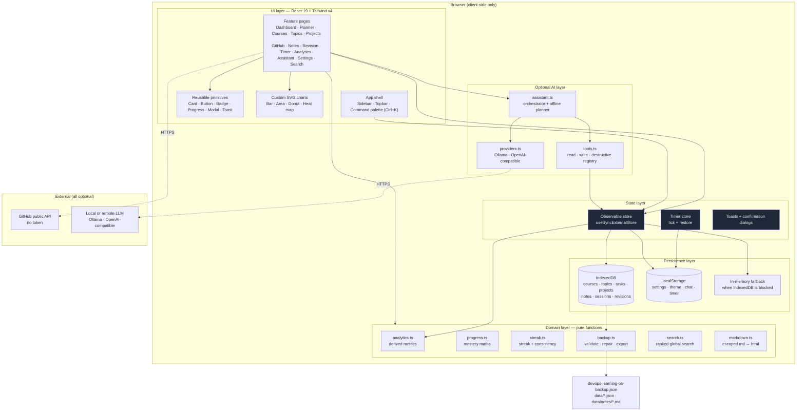

# DevOps Learning OS

A **personal DevOps learning management dashboard** that runs entirely in your browser.
Track courses, topics, projects, notes, study time, streaks, revision and GitHub activity —
with an optional local AI assistant.

No backend. No database server. No paid API. No account. Deployable on **GitHub Pages only**.

```
npm install
npm run dev      # http://localhost:5173
npm run build    # static bundle in dist/
```

---

## Table of contents

- [Why this exists](#why-this-exists)
- [Feature tour](#feature-tour)
- [Architecture](#architecture)
- [Tech stack](#tech-stack)
- [Screenshots](#screenshots)
- [Local installation](#local-installation)
- [GitHub Pages deployment](#github-pages-deployment)
- [Data storage explained](#data-storage-explained)
- [Backup and restore](#backup-and-restore)
- [The AI assistant](#the-ai-assistant)
- [Security considerations](#security-considerations)
- [Project structure](#project-structure)
- [Sample data](#sample-data)
- [Testing](#testing)
- [Troubleshooting](#troubleshooting)
- [Future improvements](#future-improvements)

---

## Why this exists

Most "learning dashboards" are either a spreadsheet that rots, or a CRUD tutorial
project that looks like a college assignment. This one is built like a product:

- **The dashboard answers eight questions immediately** — what should I study today,
  how much have I completed, what is pending, which course is unfinished, which topics
  need revision, how many hours have I studied, what am I building, what should I do next.
- **It never loses data** — everything is persisted to IndexedDB, with JSON export/import
  and a git-friendly markdown backup.
- **It works offline** — after the first load there is nothing to fetch except the
  optional GitHub lookup and your own AI provider.
- **Zero running costs** — a static bundle on GitHub Pages, with local-first storage.

---

## Feature tour

### 1. Dashboard

Overall / today / weekly / monthly progress, current and longest streak, total study
hours, completed and pending tasks, course and project progress, GitHub activity,
note count and the revision queue — plus a ranked "what should I do next?" card.

- Weighted overall score: topics **60%**, courses **25%**, projects **15%**
- Per-subject progress bars for DevOps, AWS, Docker, Kubernetes, Terraform, CI/CD,
  Monitoring and Java
- 14-day daily-hours area chart, 8-week weekly bar chart, subject-mix donut
- GitHub-style study activity heat map (26 weeks)

### 2. Strict daily study planner

A day-wise plan with date, subject, topic, task, planned duration, actual duration,
priority, status (`Pending · In Progress · Completed · Skipped`) and notes.

- Week strip with per-day completion counters
- Automatic budget maths: **target · completed · remaining**
- Per-subject grouping, so "DevOps — 2h" and "Java — 2h" are tracked separately
- Day and week views, status changes inline, study sessions logged per day

### 3. Course tracker

Courses with instructor, platform, link, category, status, module counts and an
optional **module → lesson** breakdown (duration, status, notes, revision flag).

- Progress is derived from lessons when a breakdown exists, otherwise from the
  manual module counter: `completed / total × 100`
- Flagging a lesson for revision automatically creates a topic in the revision queue

### 4. Topic tracker

28 seeded topics across Linux, Git, GitHub, Docker, Docker Compose, Docker Swarm,
Kubernetes, Jenkins, GitHub Actions, CI/CD, Terraform, Ansible, AWS, Networking,
Monitoring, Prometheus, Grafana, Python, Java, Spring Boot and SQL.

Each topic carries status (`Not Started · Learning · Practiced · Completed ·
Need Revision`), mastery %, confidence (1–5), difficulty, last studied date, next
revision date, revision count, resource link and notes.

### 5. Project tracker

Project name, description, technologies, repository, start/target dates, status and a
checklist with automatic completion percentage. Includes a **deadline radar** that
surfaces everything due (or overdue) in the next two weeks.

### 6. GitHub section

Public repository data from GitHub's unauthenticated REST API: names, descriptions,
languages, stars, forks, issues, last updated and URLs, plus the recent public event
feed and a language breakdown. A refresh button makes the fetch explicit.

### 7. Notes system

Create, edit, delete, search, tag, pin and archive. Markdown content with a live
preview, a write/preview toggle and an interview-ready template
(Definition · Commands · Examples · Common mistakes · Interview questions · My notes).
`#hashtags` typed in the body are folded into the tag list automatically.

### 8. Revision system

Spaced repetition driven by self-rated confidence:

| Confidence | Next revision |
| ---------- | ------------- |
| 1/5        | tomorrow      |
| 2/5        | in 2 days     |
| 3/5        | in 4 days     |
| 4/5        | in a week     |
| 5/5        | in a month    |

The interval stretches with each completed revision. Topics are flagged automatically
when they are manually marked, overdue, or rated 1–2.

### 9. Study timer

Pomodoro presets (25 / 50 / custom), start, pause, resume, +5 minutes, reset.
When a session finishes it asks **"What did you study?"** and saves date, topic,
duration and notes. The timer survives navigation *and* a page refresh.

### 10. Streak system

Current streak, longest streak and a 26-week contribution calendar. A streak may rest
on today (it breaks only once a day is fully missed).

### 11. Analytics

Daily, weekly and monthly hours, weekday averages, task lifecycle breakdown,
course/topic/project completion, consistency over 28 days and one-click markdown
report export.

### 12. Global search

One query across courses, topics, tasks, projects, notes and sessions, with ranked
results, matched-text highlighting and deep links into the right page.

### 13. Command centre

`Ctrl + K` (or `Cmd + K`) from anywhere. Navigate, create a task/course/topic/project/note,
start a timer, search everything, export a backup, open the GitHub page or the assistant.
Full arrow-key navigation.

### 14. Settings

Profile, learning targets, preferred study time, theme (dark / light / system),
AI provider configuration and full data management.

---

## Architecture



**Data flow:** a page calls a store action → the action updates in-memory state and
writes the single changed record to IndexedDB → subscribers re-render → pure domain
functions recompute derived metrics. Nothing is ever sent to a server.

---

## Tech stack

| Concern         | Choice                                                | Why                                                        |
| --------------- | ----------------------------------------------------- | ---------------------------------------------------------- |
| UI              | React 19 + TypeScript (strict)                        | Typed domain model, reusable components                     |
| Build           | Vite 8                                                | Fast dev server, tiny static output, GitHub Pages friendly   |
| Styling         | Tailwind CSS v4 with CSS-variable design tokens       | One token layer drives dark **and** light themes            |
| Persistence     | IndexedDB via `idb`                                   | Real database semantics, large quota, survives refresh      |
| Settings        | `localStorage`                                        | Small, synchronous, ideal for preferences                    |
| Routing         | React Router 7 (`HashRouter`)                         | Deep links and refreshes never 404 on GitHub Pages           |
| Charts          | Hand-written SVG/CSS                                  | Zero chart dependency, full control, small bundle            |
| AI              | `fetch` to Ollama / OpenAI-compatible endpoints        | Provider-agnostic, no vendor SDK, no hard-coded keys         |

Bundle: ~172 kB gzipped JS + ~10 kB gzipped CSS.

---

## Screenshots

> Capture these after your first run — the sample profile is designed to look good.

| View                | File                              |
| ------------------- | --------------------------------- |
| Dashboard           | `docs/screenshots/dashboard.png`  |
| Study planner       | `docs/screenshots/planner.png`    |
| Courses & modules   | `docs/screenshots/courses.png`    |
| Topics & revision   | `docs/screenshots/revision.png`   |
| Analytics           | `docs/screenshots/analytics.png`  |
| AI assistant        | `docs/screenshots/assistant.png`  |
| Command palette     | `docs/screenshots/palette.png`    |

To add them:

```bash
mkdir -p docs/screenshots
# then screenshot each page and reference it here, e.g.
# 
```

---

## Local installation

Requirements: **Node.js 20+** and npm.

```bash
git clone https://github.com/<you>/devops-learning-os.git
cd devops-learning-os
npm install
npm run dev
```

| Script               | What it does                                                |
| -------------------- | ----------------------------------------------------------- |
| `npm run dev`        | Vite dev server with hot reload on `http://localhost:5173`  |
| `npm run build`      | Type-check, then emit the production bundle to `dist/`      |
| `npm run preview`    | Serve the built bundle locally on port 4173                 |
| `npm run typecheck`  | `tsc --noEmit` only                                          |
| `npm run test:smoke` | Headless-Chrome end-to-end smoke test (see [Testing](#testing)) |

### First run

The app seeds a **realistic DevOps learner profile** so the dashboard is never empty:
5 courses, 28 topics, 20 planned tasks, 4 projects, 7 notes, 57 study sessions and 8
revision records. Wipe it any time from **Settings → Data → Reset application**.

---

## GitHub Pages deployment

1. Push the repository to GitHub.
2. **Settings → Pages → Build and deployment → Source: GitHub Actions.**
3. Push to `main`. `.github/workflows/deploy.yml` installs, type-checks, builds and
   publishes `dist/` automatically.

The build uses `base: './'` and hash routing, so the app works at
`https://<user>.github.io/<repo>/` without extra configuration — and also at a domain
root if you later add a custom domain.

> No repository secrets are required. The workflow never touches a backend.

---

## Data storage explained

```
src/db/
├── database.ts   # IndexedDB abstraction + in-memory fallback
└── seed.ts       # realistic sample profile
```

- **IndexedDB — `devops-learning-os` v1** with one object store per collection:
  `courses`, `topics`, `tasks`, `projects`, `notes`, `sessions`, `revisions`.
  Each record is keyed by `id`, so an update writes a single row instead of
  rewriting the database.
- **localStorage** holds only lightweight settings: `devops-os:settings`,
  `devops-os:theme`, `devops-os:chat`, `devops-os:timer`.
- **Graceful degradation.** If IndexedDB is unavailable (private windows, hardened
  settings, quota), the layer transparently falls back to an in-memory map and the UI
  shows a persistence warning instead of crashing.
- **No data loss on refresh** — verified by the smoke test, which creates a task,
  reloads the page and asserts it is still there.

```ts
// Adding a task touches exactly one record
await store.addTask({ title: 'Kubernetes Ingress', plannedMinutes: 45 });
```

---

## Backup and restore

**Settings → Data** provides:

| Action                    | Output                                                              |
| ------------------------- | ------------------------------------------------------------------- |
| Export all data           | `devops-learning-os-backup.json` — courses, topics, tasks, projects, notes, sessions, revisions, settings |
| Import data               | Reads a backup, validates it, then **replace** or **merge by id**     |
| Export notes              | `devops-notes.md`                                                   |
| Export progress           | `devops-progress.md`                                                |
| Generate GitHub backup    | A set of files for a `data/` folder (below)                          |

### GitHub backup workflow

**Generate GitHub backup** produces committable files:

```
data/
├── README.md            # index (lists every generated file)
├── courses.json
├── topics.json
├── tasks.json
├── projects.json
├── study-sessions.json
├── revisions.json
├── settings.json        # API key stripped
├── progress.md          # human-readable report
└── notes/
    ├── README.md        # all notes as one markdown document
    └── 01-kubernetes-service-complete-reference.md
    └── 02-docker-networking-cheat-sheet.md
    └── …
```

Each note gets YAML front-matter (title, topic, tags, created, updated, pinned, archived),
so it renders nicely on GitHub. **No secrets are ever written** — the AI API key is
removed before generation.

> The granular files are for version control and human reading. To restore state in
> the app, import a full `devops-learning-os-backup.json`.

---

## The AI assistant

The assistant is **optional**. Without a provider it still works: a deterministic
offline planner reads your tasks, courses, topics and revision queue and produces a
study plan (including in Bengali if you ask in Bengali).

### Providers

| Provider              | Endpoint                                      | Notes                                    |
| --------------------- | --------------------------------------------- | ---------------------------------------- |
| None                  | —                                             | Offline planner, nothing leaves the app  |
| Ollama                | `http://localhost:11434`                      | Fully local; needs `OLLAMA_ORIGINS=*`    |
| OpenAI-compatible     | `https://api.openai.com/v1` and friends        | OpenAI, Groq, OpenRouter, LM Studio, vLLM, llama.cpp |

Configure in **Settings → AI provider**, then press **Test connection**.

### Tool system

The model can only *ask* for a tool; this app decides what actually happens.

| Kind            | Tools                                                                                          | Behaviour                       |
| --------------- | ---------------------------------------------------------------------------------------------- | ------------------------------- |
| **read**        | `getProgress` `getTodayTasks` `getCourseStatus` `getTopicStatus` `getRevisionQueue` `searchNotes` `getGitHubRepositories` `getProjects` `getStudyStats` | Run automatically                |
| **write**       | `createTask` `completeTask` `createNote` `updateNote` `updateProgress` `createProject` `addProjectTask` `logStudySession` | Confirmed by the user first      |
| **destructive** | `deleteNote` `deleteTask` `deleteTopic`                                                                   | Always confirmed, highlighted red |

Example flow:

```
AI:   I want to delete “Docker Swarm notes”.
      deleteNote(title: "Docker Swarm notes")

UI:   [ Cancel ]  [ Confirm delete ]
```

Nothing is written until **Confirm** is clicked, and a cancelled action is recorded in
the transcript. There is deliberately **no shell, filesystem, network or eval tool**.

### What is sent

Only a bounded snapshot — overall progress, today's tasks, course/topic summaries,
project statuses, recent note titles and cached repo names — never your full database,
never your API key.

---

## Security considerations

- **No secrets in the repository or the bundle.** No GitHub token is used or requested;
  the AI key is entered in the UI and stored in this browser's `localStorage` only.
- **No arbitrary code execution.** The assistant cannot run JavaScript, shell commands
  or filesystem operations.
- **Markdown is escaped before rendering.** Note and AI content is HTML-escaped first,
  then a fixed allow-list of inline constructs is re-introduced, so note content can
  never inject HTML or script.
- **Destructive actions are confirmed** through a modal dialog that shows the exact
  JSON arguments the assistant proposed.
- **Failure isolation.** GitHub errors, offline state, invalid usernames, corrupt import
  files, invalid JSON, IndexedDB failures and an unreachable AI provider are all handled
  without taking down the app. A React error boundary isolates a single broken view.
- **XSS-safe links.** External links use `rel="noopener noreferrer nofollow"`.

---

## Project structure

```
.
├── .github/workflows/deploy.yml     # GitHub Pages CI/CD — no backend needed
├── public/
│   ├── favicon.svg
│   └── .nojekyll                    # stop Pages from ignoring hashed assets
├── scripts/
│   └── smoke.mjs                    # headless end-to-end test
├── src/
│   ├── App.tsx                      # hash router + theme sync + routes
│   ├── main.tsx                     # entry point (boots the store)
│   ├── index.css                    # design tokens, themes, prose styles
│   ├── types.ts                     # domain model + label metadata
│   ├── ai/
│   │   ├── assistant.ts             # orchestrator + offline planner
│   │   ├── context.ts               # bounded prompt snapshot
│   │   ├── providers.ts             # Ollama / OpenAI-compatible clients
│   │   └── tools.ts                 # tool registry (read/write/destructive)
│   ├── components/
│   │   ├── charts/index.tsx         # bar, area, donut, heat map (hand-written SVG)
│   │   ├── icons.tsx                 # dependency-free SVG icon set
│   │   ├── layout/                  # shell, sidebar, topbar, palette, 404-safe nav
│   │   └── ui/                      # primitives, form controls, overlays
│   ├── db/
│   │   ├── database.ts              # IndexedDB abstraction + memory fallback
│   │   └── seed.ts                  # sample DevOps learner profile
│   ├── features/                    # one folder per page (+ shared dialogs)
│   ├── lib/                         # pure domain + utilities
│   │   ├── analytics.ts  backup.ts  date.ts  github.ts  hooks.ts
│   │   ├── markdown.ts   progress.ts  search.ts  streak.ts  utils.ts
│   └── store/
│       ├── store.ts                 # central observable store + all actions
│       ├── timer.ts                 # Pomodoro store
│       └── defaults.ts              # default settings + theme application
├── index.html
├── tsconfig.json
└── vite.config.ts
```

---

## Sample data

A realistic DevOps learner profile is generated relative to *today*, so charts,
streaks and the heat map are alive on first load:

- **Courses** — TrainWithShubham Complete DevOps (with a full module/lesson tree),
  AWS SAA, Kubernetes for Beginners, Terraform IaC, Java Masterclass
- **Topics** — Linux → Git → Docker → Kubernetes → Jenkins → Terraform → AWS →
  Monitoring → Java → Spring Boot → SQL → Python
- **Projects** — Terraform AWS Infrastructure, Docker Compose Application,
  Kubernetes Deployment, AI Kubernetes Incident Response
- **Notes** — 7 interview-ready notes (Kubernetes Service, Docker networking,
  Terraform state, Jenkins pipeline, AWS VPC, Java collections, one archived draft)
- **Sessions** — 60 days of history shaped to show a **12-day current streak** and an
  18-day longest streak

Reset or reload it from **Settings → Data**.

---

## Testing

`scripts/smoke.mjs` drives the production bundle in headless Chrome and asserts:

- the shell boots from IndexedDB and renders the dashboard
- sample data is seeded and visible
- every route renders the expected content with no crash
- a task created through the UI survives a full page reload
- the command palette opens with `Ctrl + K` and finds results
- the theme toggle switches to light and persists to `localStorage`
- a note can be created and its markdown renders as HTML
- the backup payload serialises with all collections

```bash
npm install
npm run build
npm run test:smoke      # builds nothing; starts its own preview server
```

Set `CHROME_PATH=/path/to/chrome` if Chrome is not at a standard location.

---

## Troubleshooting

| Symptom                                   | Cause and fix                                                                                    |
| ----------------------------------------- | ------------------------------------------------------------------------------------------------ |
| Dashboard is empty                        | **Settings → Data → Reload sample data**, or check that IndexedDB is enabled                      |
| "Storage warning" banner                  | IndexedDB is blocked (private window / quota). Export a backup; changes last for this session only |
| GitHub section shows a rate-limit error   | Anonymous limit is 60 requests/hour per IP. Cached data is shown; try again later                  |
| AI provider cannot be reached             | For Ollama, start it with `OLLAMA_ORIGINS=* ollama serve` so the browser may call it cross-origin  |
| Nothing appears after deploying            | Set **Pages → Source: GitHub Actions**, and make sure `dist/.nojekyll` is published               |
| Deep link 404s                             | Use the hash form (`/#/planner`); routing is deliberately hash-based for Pages                     |

---

## Future improvements

- Workbox service worker for full offline install (PWA) and installable app shell
- Drag-and-drop reordering of planner tasks and module tree editing
- Timed mock interviews generated from low-confidence topics
- Auto-import study sessions from a CSV export of an external tracker
- Per-subject target curves and a "weeks until interview-ready" projection
- Optional end-to-end encrypted sync to a private Gist, still with no server
- i18n pack so the whole UI can follow the assistant's language detection

---

## License

MIT — use it, fork it, make it yours.
